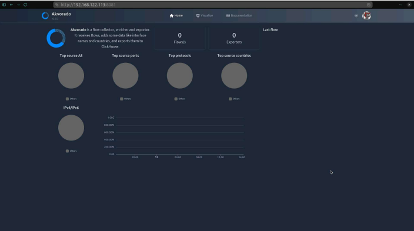
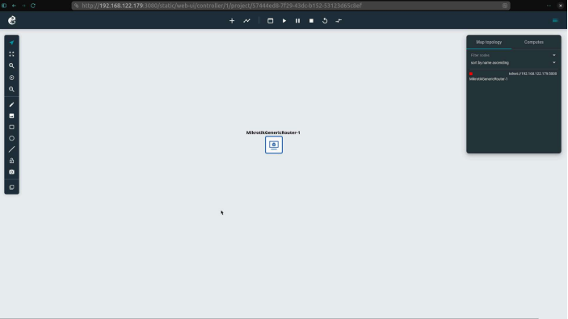

# 🌐 Network Monitoring Lab – NetFlow/IPFIX

Trabajo práctico final de Redes de Datos enfocado en la implementación de un sistema de monitoreo y visualización de tráfico de red utilizando tecnologías reales de infraestructura.

El proyecto integra herramientas de análisis de flujos (NetFlow/IPFIX), virtualización de redes y despliegue de servicios en entornos Linux.

---

## 🧠 Descripción

Este trabajo final tiene como objetivo diseñar e implementar un entorno funcional de monitoreo de red, capaz de recolectar, procesar y visualizar información de tráfico en tiempo real.

Se utilizó **Akvorado** como plataforma principal de visualización y análisis de flujos de red, permitiendo observar métricas como:

- volumen de tráfico
- protocolos utilizados
- direcciones IP origen/destino
- comportamiento general de la red

---

## ⚙️ Tecnologías utilizadas

- Linux (Debian 13)
- Docker & Docker Compose
- Akvorado (NetFlow/IPFIX collector & visualizer)
- GNS3 (simulación de red)
- NetFlow / IPFIX
- SSH (configuración segura de acceso remoto)

---

## 🧩 Arquitectura del sistema

El entorno se compone de:

- una máquina virtual con Debian sin entorno gráfico
- servicios desplegados mediante Docker
- Akvorado como colector y visualizador de flujos
- dispositivos de red simulados enviando tráfico (NetFlow/IPFIX)

Los dispositivos de red fueron configurados para exportar flujos hacia el servidor, permitiendo su análisis en la interfaz web de Akvorado.

---

## 📊 Funcionalidades implementadas

- recolección de tráfico mediante NetFlow/IPFIX
- visualización de datos en tiempo real
- clasificación de interfaces y dispositivos
- análisis de patrones de tráfico
- monitoreo de actividad de red

---

## 🔧 Configuración destacada

- endurecimiento de SSH (cambio de puerto, autenticación por claves, restricción de usuarios)
- despliegue de contenedores con Docker
- configuración de exportación de flujos:
  - NetFlow (puerto 2055)
  - IPFIX (puerto 4739)
- integración de múltiples herramientas en un entorno virtualizado

---

## 🛠️ Troubleshooting

Durante el desarrollo se resolvieron problemas reales de infraestructura, como:

- saturación de espacio en disco en contenedores
- configuración de rutas y almacenamiento
- conflictos de versiones en Docker
- dependencias en entornos Linux mínimos

Estas resoluciones forman parte clave del aprendizaje práctico del proyecto.

---

## 🧪 Experiencia previa (GNS3)

Antes de este trabajo final, se desarrollaron múltiples laboratorios utilizando **GNS3**, donde se trabajó con:

- diseño de topologías de red
- configuración de routers y switches
- segmentación de redes (subnetting)
- pruebas de conectividad y routing
- integración de redes virtuales con entornos reales

Este conocimiento fue fundamental para la correcta implementación del sistema de monitoreo en el proyecto final.

---

## 📸 Capturas

### Dashboard de Akvorado

### Entorno en GNS3

---

## 📁 Estructura del repositorio
- images/ → capturas del sistema
- docs/ → documentación del trabajo

---

## 📄 Documentación

El detalle completo de la implementación se encuentra en:

- `network-monitoring-report.pdf`

---

## 🚀 Estado del proyecto

Proyecto finalizado como trabajo integrador académico.  
El entorno es funcional y permite el análisis básico de tráfico de red en laboratorio.

---

## 👨‍💻 Autor

Alejandro Escallier  
Estudiante de Ingeniería en Sistemas de Información  

GitHub: https://github.com/Alescallier  
LinkedIn: https://linkedin.com/in/alejandro-escallier  

---

## 📌 Notas

Este repositorio presenta una versión simplificada del proyecto, incluyendo documentación y resultados.  
La infraestructura completa no se incluye debido a su complejidad y tamaño.
